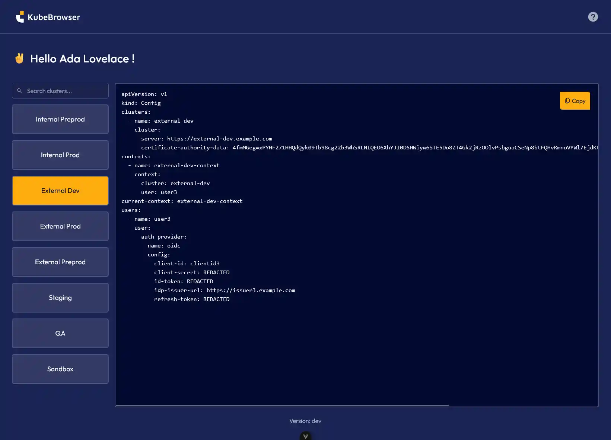

[](https://artifacthub.io/packages/helm/avisto/kubebrowser)


# Kubebrowser - Your Kubernetes catalog with OIDC

## What is Kubebrowser?

Kubebrowser is a self-service platform that enables users to obtain their own Kubeconfig credentials using OIDC authentication.



## Features
Managing access across multiple Kubernetes clusters can be challenging, especially when dealing with different teams, roles, and providers. Kubebrowser streamlines this process with:

🚀 Self-Service Access: Users can generate their own Kubeconfigs without manual intervention.

🔐 OIDC Integration: Secure authentication with identity providers.

🌍 Multi-Cluster Support: Manage access across multiple Kubernetes clusters easily.

✅ Whitelist Management: Allow administrators to set a whitelist on each Kubeconfig.

## Getting started

Using our Helm chart, the installation is straightforward.

Prepare `values.yaml`

```yaml
server:
  oidc:
    clientID: <your-client-id>
    clientSecret: <your-client-secret>
    issuerURL: <your-issuer-url>
```

Add repository

```
helm repo add avisto https://avistotelecom.github.io/charts/
```

Install chart

```
helm install my-kubebrowser avisto/kubebrowser -f values.yaml
```

Create Kubeconfig

```yaml
apiVersion: kubebrowser.io/v1alpha1
kind: Kubeconfig
metadata:
  name: cluster-name
spec:
  name: "Friendly name"
  kubeconfig:           # Paste here the content of your Kubeconfig
    apiVersion: v1
    kind: Config
    clusters:
    - cluster:
        certificate-authority-data: <base64-encoded>
        server: https://127.0.0.1:32771
      name: cluster
    contexts:
    - context:
        cluster: cluster
        user: placeholder
      name: context
    current-context: context
  whitelist:            # These are grabbed from your OIDC provider
    groups:
    - administrators
    users:
    - alan.turing@example.com
    - ada.lovelace@example.com
```

## Documentation

Check our [documentation](https://avistotelecom.github.io/kubebrowser/getting-started.html) for more details.

## Community

If you find a bug or have a question or a feature request, head to the [GitHub issues](https://github.com/AvistoTelecom/kubebrowser/issues).
To contribute to the code, open an issue first and read the [contribution documentation](https://avistotelecom.github.io/kubebrowser/contribute.html).
